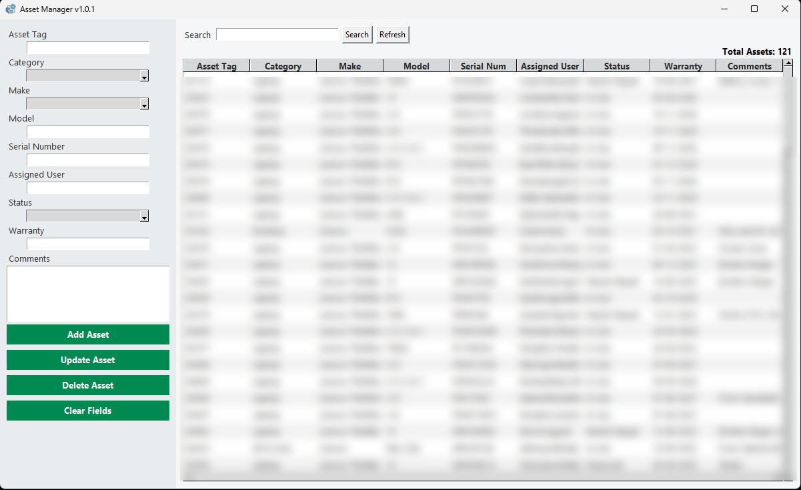

# Asset Manager

A desktop application built with Python and Tkinter for managing IT hardware assets. The application is **live and actively used in a production work environment**.

---

## Features

- Add, update, and delete asset records
- Search across all fields with partial/wildcard matching
- Sortable columns (click any column heading to sort)
- Alternating row colours for readability
- Input validation (e.g. Assigned User must follow `name.surname` format)
- Persistent storage via SQLite database
- Compiled as a standalone `.exe` using PyInstaller

---

## Tech Stack

- Python 3
- Tkinter (GUI)
- SQLite3 (database)
- PyInstaller (packaging)

---

## Database Path

In the live production environment the database is stored on a shared network drive:

```python
BASE_DIR = r"\\Servername\path\Asset Manager\Database\Assets"
```

If you want to run this on your own machine, replace the `BASE_DIR` line in `asset_manager.py` with:

```python
BASE_DIR = os.path.join(os.path.expanduser("~"), "AssetManager")
```

This will store the database in a folder called `AssetManager` inside your home directory, and will work on any Windows, macOS, or Linux machine without any additional setup.

---

## How to Run

1. Clone the repository:
   ```bash
   git clone https://github.com/LwaziNdwandwe/asset-manager.git
   ```

2. Install dependencies (only the standard library is required — no pip installs needed):
   ```bash
   python asset_manager.py
   ```

3. Update `BASE_DIR` as described above before running.

---

## Asset Fields

| Field | Description |
|---|---|
| Asset Tag | Unique identifier for the device |
| Category | Laptop, Desktop, or All-in-One |
| Make | Manufacturer / product line |
| Model | Specific model name or number |
| Serial Number | Physical device serial number |
| Assigned User | Format: `name.surname` |
| Status | Lifecycle state (e.g. In Use, Disposed) |
| Warranty | Expiry date or warranty reference |
| Comments | Any additional notes |

---

## Screenshots


